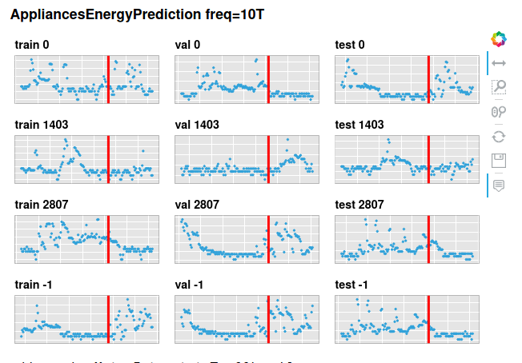
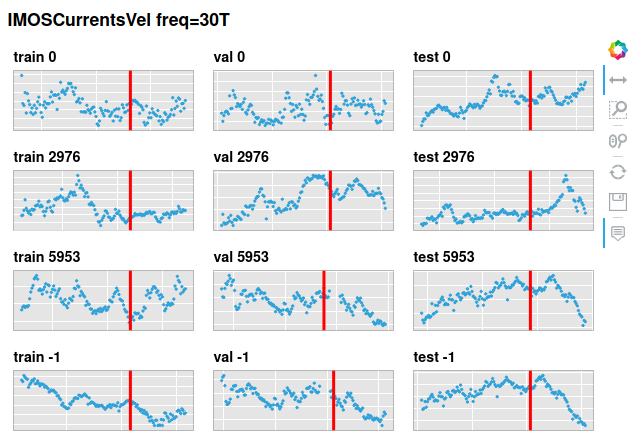
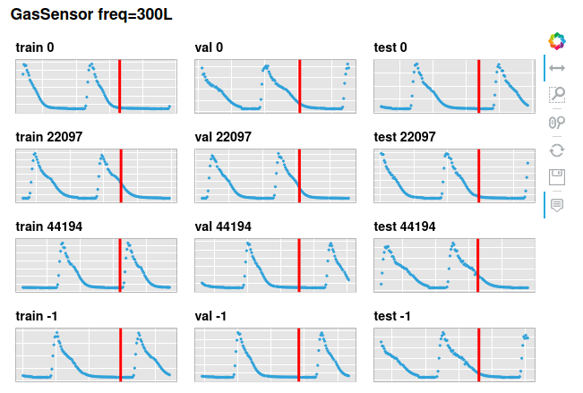
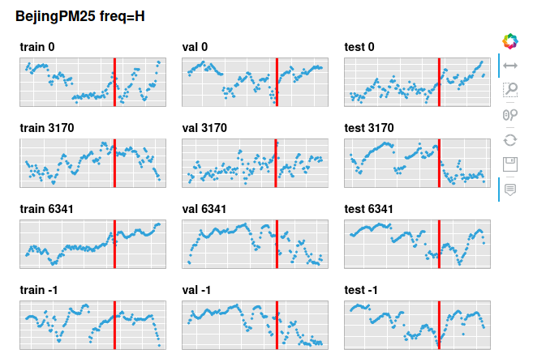

seq2seq-time
==============================

Using sequence to sequence interfaces for timeseries regression


<table border="1" class="dataframe">
  <thead>
    <tr style="text-align: right;">
      <th></th>
      <th>BaselineLast</th>
      <th>RANP</th>
      <th>LSTM</th>
      <th>LSTMSeq2Seq</th>
      <th>TransformerSeq2Seq</th>
      <th>TransformerProcess</th>
    </tr>
  </thead>
  <tbody>
    <tr>
      <th>IMOSCurrentsVel</th>
      <td>1.63</td>
      <td>23.31</td>
      <td>19.44</td>
      <td>14.52</td>
      <td>46.98</td>
      <td>7.35</td>
    </tr>
    <tr>
      <th>BejingPM25</th>
      <td>1.71</td>
      <td>1.48</td>
      <td>1.41</td>
      <td>1.39</td>
      <td>2.86</td>
      <td>1.44</td>
    </tr>
    <tr>
      <th>GasSensor</th>
      <td>1.88</td>
      <td>-2.24</td>
      <td>16.40</td>
      <td>-1.53</td>
      <td>NaN</td>
      <td>0.63</td>
    </tr>
    <tr>
      <th>AppliancesEnergyPrediction</th>
      <td>1.56</td>
      <td>1.31</td>
      <td>1.94</td>
      <td>1.57</td>
      <td>2.33</td>
      <td>1.08</td>
    </tr>
    <tr>
      <th>MetroInterstateTraffic</th>
      <td>1.76</td>
      <td>-0.27</td>
      <td>-0.17</td>
      <td>-0.25</td>
      <td>4.15</td>
      <td>-0.27</td>
    </tr>
  </tbody>
</table>

## Datasets

To ensure a robust score we use multiple multivariate regression timeseries.

For more see [notebooks/01.0-mc-datasets.ipynb](notebooks/01.0-mc-datasets.ipynb)







## Project Organization
------------

    ├── LICENSE
    ├── Makefile           <- Makefile with commands like `make data` or `make train`
    ├── README.md          <- The top-level README for developers using this project.
    ├── data
    │   ├── interim        <- Intermediate data that has been transformed.
    │   ├── processed      <- The final, canonical data sets for modeling.
    │   └── raw            <- The original, immutable data dump.
    │
    ├── notebooks          <- Jupyter notebooks. Naming convention is a number (for ordering),
    │                         the creator's initials, and a short `-` delimited description, e.g.
    │                         `1.0-jqp-initial-data-exploratio    │
    │
    ├── reports            <- Generated analysis as HTML, PDF, LaTeX, etc.
    │   └── figures        <- Generated graphics and figures to be used in reporting
    │
    ├── requirements       <- The requirements folder for reproducing the analysis environment, e.g.
    │                         generated with `pip freeze > requirements.txt`
    │
    ├── setup.py           <- makes project pip installable (pip install -e .) so src can be imported
    ├── seq2seq_time       <- Source code for use in this project.
    │
    └── tox.ini            <- tox file with settings for running tox; see tox.readthedocs.io


--------

<p><small>Project based on the <a target="_blank" href="https://drivendata.github.io/cookiecutter-data-science/">cookiecutter data science project template</a>. #cookiecutterdatascience</small></p>

```python

```
