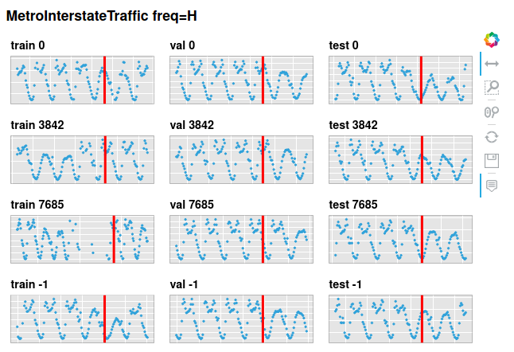

seq2seq-time
==============================

Using sequence to sequence (and normal) interfaces for multivariate timeseries regression.

Since this is a deep learning approach it's hard to do hyperparameter optimisation for every model, so be aware that these are only indicative number. The most interesting results are which models are robust, and which models fail for certain dataset.

NOTE: This is a work in progress, with out final numbers...


  
# Results


NOTE: Draft numbers

- [ ] TODO mean over N runs
- [ ] TODO hyperparameter opt to make sure I'm comparing optimal hidden_size

|                    |   MetroInterstateTraffic |   BejingPM25 |   GasSensor |   AppliancesEnergyPrediction |   IMOSCurrentsVel |   mean(e-e_baseline) |
|:-------------------|-------------------------:|-------------:|------------:|-----------------------------:|------------------:|---------------------:|
| RANP               |                    -0.43 |         1.35 |       -2.31 |                         1.6  |              1.39 |                -1.1  |
| LSTMSeq2Seq        |                    -0.01 |         1.28 |       -0.82 |                         1.67 |              0.93 |                -0.81 |
| Transformer        |                    -0.28 |         1.88 |       -2.28 |                         2.52 |              1.75 |                -0.7  |
| LSTM               |                     0.03 |         1.35 |       -0.38 |                         1.66 |              1.37 |                -0.61 |
| TransformerProcess |                    -0.36 |         1.49 |       -0.84 |                         1.65 |              2.39 |                -0.55 |
| InceptionTimeSeq   |                    -0.23 |         1.5  |       -0.8  |                         2.41 |              2.95 |                -0.25 |
| TransformerSeq2Seq |                     0.2  |         1.96 |        0.44 |                         1.88 |              2.38 |                -0.05 |
| BaselineMean       |                     1.43 |         1.59 |        1.54 |                         1.42 |              1.1  |                 0    |
| TCNSeq             |                    -0.27 |         2.22 |       -0.6  |                         5.27 |              0.96 |                 0.1  |
| BaselineLast       |                     1.75 |         1.59 |        1.87 |                         1.57 |              0.93 |                 0.12 |

## Datasets

To ensure a robust score we use multiple multivariate regression timeseries.

For more see [notebooks/01.0-mc-datasets.ipynb](notebooks/01.0-mc-datasets.ipynb) or [notebooks/01.0-mc-datasets/index.html](notebooks/01.0-mc-datasets/index.html)


Applience energy usage prediction.


30 minute, current speed at Two Rocks 200m Mooring. Has tidal periods as extra features.


A metal oxide (MOX) gas sensor exposed during 3 weeks to mixtures of carbon monoxide and humid synthetic air in a gas chamber.


Hourly PM2.5 data of US Embassy in Beijing. This measures smoke as well as some pollen, fog, and dust particles of a certain size. Weather data from a nearby airport are included.



Hourly Minneapolis-St Paul, MN traffic volume for westbound I-94. Includes weather and holiday features from 2012-2018.

## Project Organization
------------

    ├── LICENSE
    ├── Makefile           <- Makefile with commands like `make data` or `make train`
    ├── README.md          <- The top-level README for developers using this project.
    ├── data
    │   ├── interim        <- Intermediate data that has been transformed.
    │   ├── processed      <- The final, canonical data sets for modeling.
    │   └── raw            <- The original, immutable data dump.
    │
    ├── notebooks          <- Jupyter notebooks. Naming convention is a number (for ordering),
    │                         the creator's initials, and a short `-` delimited description, e.g.
    │                         `1.0-jqp-initial-data-exploratio    │
    │
    ├── reports            <- Generated analysis as HTML, PDF, LaTeX, etc.
    │   └── figures        <- Generated graphics and figures to be used in reporting
    │
    ├── requirements       <- The requirements folder for reproducing the analysis environment, e.g.
    │                         generated with `pip freeze > requirements.txt`
    │
    ├── setup.py           <- makes project pip installable (pip install -e .) so src can be imported
    ├── seq2seq_time       <- Source code for use in this project.
    │
    └── tox.ini            <- tox file with settings for running tox; see tox.readthedocs.io


--------

<p><small>Project based on the <a target="_blank" href="https://drivendata.github.io/cookiecutter-data-science/">cookiecutter data science project template</a>. #cookiecutterdatascience</small></p>

```python

```
